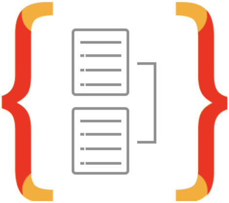

<h1 align="center">
  Chat
</h1>

<h3 align="center">
  NLW#5 - Node.js
</h3>

<p align="center">
  

  <a href="https://github.com/wladimirgrf/chat/commits/master">
    
  </a>

  <a href="https://github.com/wladimirgrf/gobarber-api/issues">
    
  </a>

  
</p>


## 🌍 Ecosystem

Below the technologies, used to build this API:

|                      Name                                   |                         Status                          |
|:-----------------------------------------------------------:|:-------------------------------------------------------:|
| |  |
| |  |
| |  |
| |  |
| |  |
| |  |
| |  |
| |  |


## 💻 Getting started

**Clone the project and access the folder**

```bash
$ git clone https://github.com/wladimirgrf/chat.git && cd chat
```

**Follow the steps below**

```bash
# Project dependencies
$ npm install

# Run the migrations
$ npm run typeorm migration:run   

# Start the api service
$ npm run dev
```

## 🤝 Contributing

**Fork the repository**

```bash
# Fork using GitHub official command line
# If you don't have the GitHub CLI, use the web site to do that.

$ gh repo fork wladimirgrf/chat
```

**Follow the steps below**

```bash
# Clone your fork
$ git clone fork-url && cd chat

# Create a branch for your edits
$ git checkout -b new-feature

# Make the commit with your changes
$ git commit -m 'feat: New feature'

# Send the code to your remote branch
$ git push origin new-feature
```

After your pull request is merged, you can delete your branch

## 📝 License

This project is licensed under the MIT License - see the [LICENSE](LICENSE) file for details.
